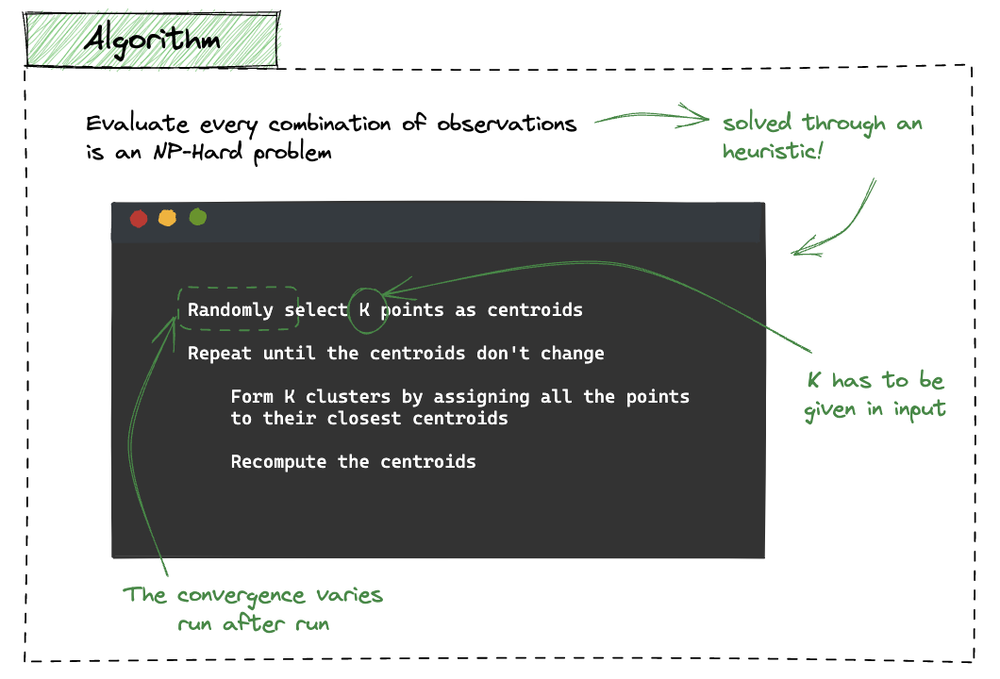
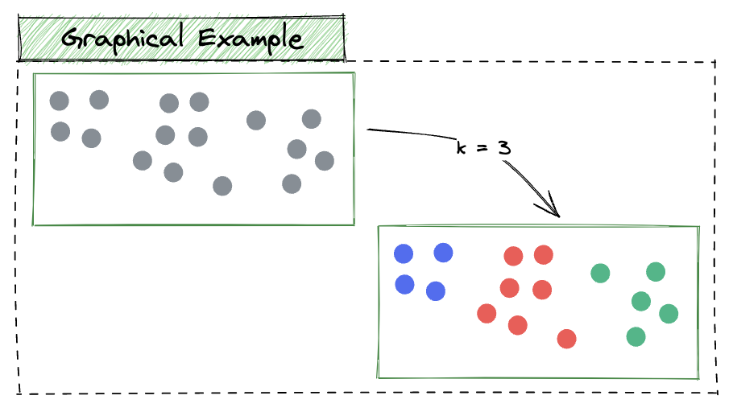
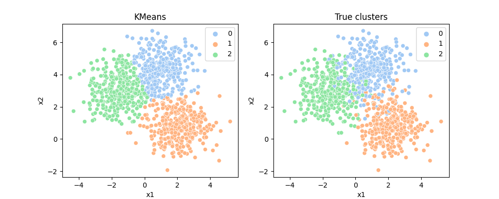

# KMeans

`KMeans` is an unsupervised algorithm whose goal is to `partite` a dataset into a `fixed number of clusters`. It does this by `iteratively` assigning each data point to the cluster with the `closest mean` (centroid) and then `updating` the cluster centroid to the mean of all data points assigned to it. The algorithm `runs` until the centroids do not change after the update, or once it reaches the maximum number of iterations.


|<center>[source](https://illustrated-machine-learning.github.io/)</center>|<center>[source](https://illustrated-machine-learning.github.io/)</center>|
|:---:|:---|
|  | |

<br />

The full implementation is available [here](./kmeans.py)!

--- 

### Demo

Import sklearn in order to create a random dataset. 

```python
from sklearn.datasets import make_blobs

import matplotlib.pyplot as plt
import seaborn as sns
```

Create the dataset via `make_blobs`. This created 1000 samples, having three approximate clusters and two features.

```python
X, y = make_blobs(n_samples=1000, centers=3, n_features=2,random_state=0)
```

Make inference over all the available data.

```python
kmeans = KMeans(n_clusters=3, random_state=42)
y_pred = kmeans.fit_predict(X)
```

Notice that most of the times we do not know the real number of clusters, but this is just a toy example. 

```python
fig, axs = plt.subplots(1,2,figsize=(10,4))

sns.scatterplot(x=X[:,0],y=X[:,1],hue=y_pred, ax=axs[0], palette="pastel")
axs[0].set_title("KMeans")
axs[0].set_xlabel("x1")
axs[0].set_ylabel("x2")

sns.scatterplot(x=X[:,0],y=X[:,1],hue=y, ax=axs[1], palette="pastel")
axs[1].set_title("True clusters")
axs[1].set_xlabel("x1")
axs[1].set_ylabel("x2")

plt.show()
```

<p align="center">
    
</p>