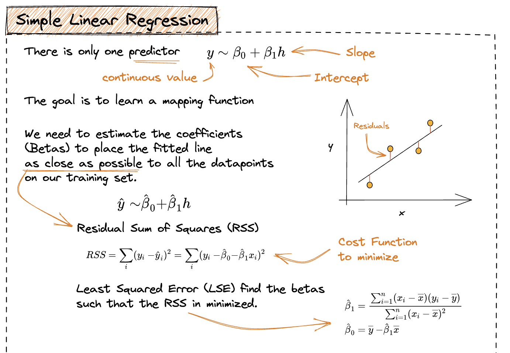
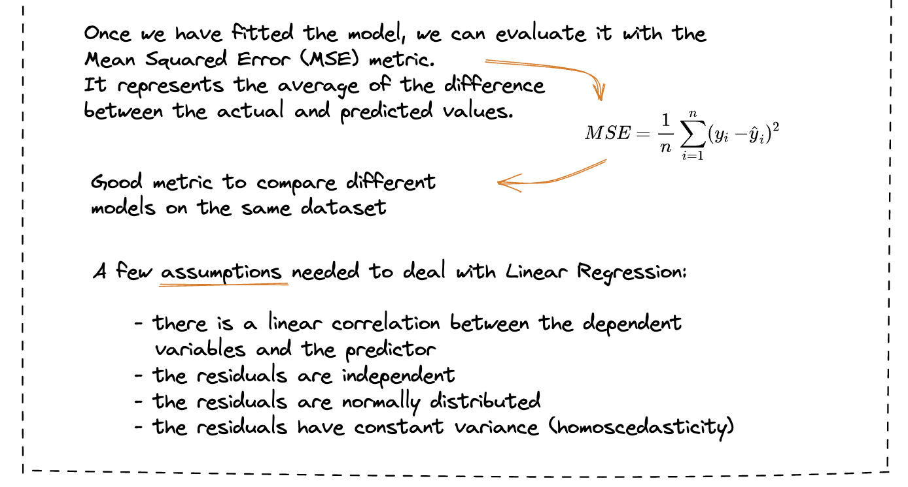
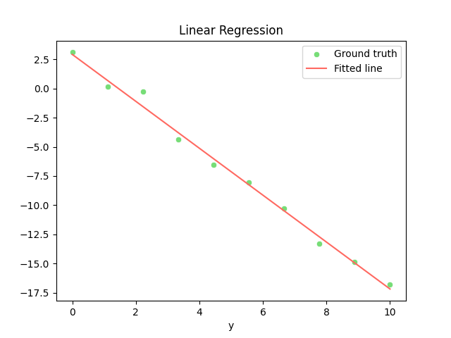

# Linear Regression

`Linear regression` is a statistical method that models the linear relationship between a dependent variable and one (or more) independent variables. 

The goal of the linear regression is to `fit a straight line` through the data points that best predicts the response variable based on the predictor variable. 

The line is represented by an equation with two parameters: the `slope` and the `intercept`.

The proposed implementation refers to the Simple Linear Regression, where we assume to deal with only one independent variable. 

|<center>[source](https://illustrated-machine-learning.github.io/)</center>|<center>[source](https://illustrated-machine-learning.github.io/)</center>|
|:---:|:---|
|  | |


---

📍 The full implementation is available [here](./linear-regression.py)!

--- 

### Demo

Import matplotlib and seaborn. 

```python
import matplotlib.pyplot as plt
import seaborn as sns
```

Create a simple `dataset` containing 10 observations, according to the equation:

$$
y = -2x + 3 + \epsilon
$$

where $\epsilon$ is a random quantity. 

```python
X = np.linspace(0,10,10)

a, b  = 3, -2
y = b * X + a + 0.7 * np.random.randn(X.shape[0])
```

`Fit` the model in order to find $\hat a$ and $\hat b$.

```python
lr = SimpleLinearRegression()
lr.fit(X,y)
```

`Plot` the ground truth and the fitted line!

```python
y_fit = lr.a + lr.b * X

sns.scatterplot(x=X,y=y, color="#77DD77")
sns.lineplot(x=X,y=y_fit, color="#FF6961")

plt.xlabel("X")
plt.xlabel("y")
plt.legend(["Ground truth","Fitted line"])
plt.title("Linear Regression")
plt.show()
```

<p align="center">
    
</p>