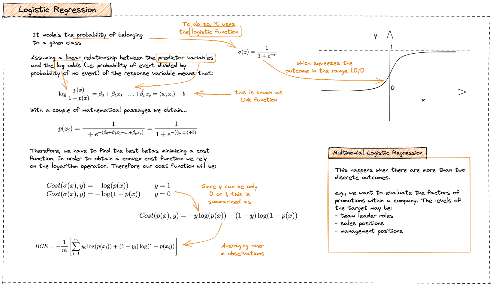

# Logistic Regression

Logistic Regression is a `statistical method` for `binary classification` problems, where the goal is to predict one of two outcomes based on a set of input features. 

Unlike linear regression, logistic regression models the relationship between the inputs and the binary output as a `logistic function`, resulting in a probability that can be thresholded to make a binary prediction.


<p align="center">
    <a href="https://illustrated-machine-learning.github.io/">source</a>
    
</p>

---

📍 The full implementation is available [here](./logistic-regression.py)!

--- 

### Demo

Import `sklearn` in order to create a random dataset and to compare our performance with the pre-implemented one. 

```python
from sklearn.datasets import make_classification
from sklearn.linear_model import LogisticRegression as LR
from sklearn.metrics import accuracy_score
```

Create the dataset via `make_classification`.

```python
X, y = make_classification(
        n_samples=1000, 
        n_features=10, 
        n_informative = 7,
        n_classes = 2, 
        random_state=42 
    )

X_train, y_train = X[:700], y[:700]
X_test, y_test = X[700:], y[700:]
```

Evaluate `our model`.

```python
lr = LogisticRegression()
lr.fit(X_train,y_train)
y_pred = lr.predict(X_test)
print(f'Accuracy (M) = {accuracy_score(y_pred,y_test):.2f}')
```

```
Accuracy (M) = 0.73
```

Evaluate the implementation available in `scikit-learn`:
```python
lr_scikit = LR()
lr_scikit.fit(X_train,y_train)
y_pred = lr.predict(X_test)
print(f'Accuracy (S) = {accuracy_score(y_pred,y_test):.2f}')
```

```
Accuracy (S) = 0.73
```